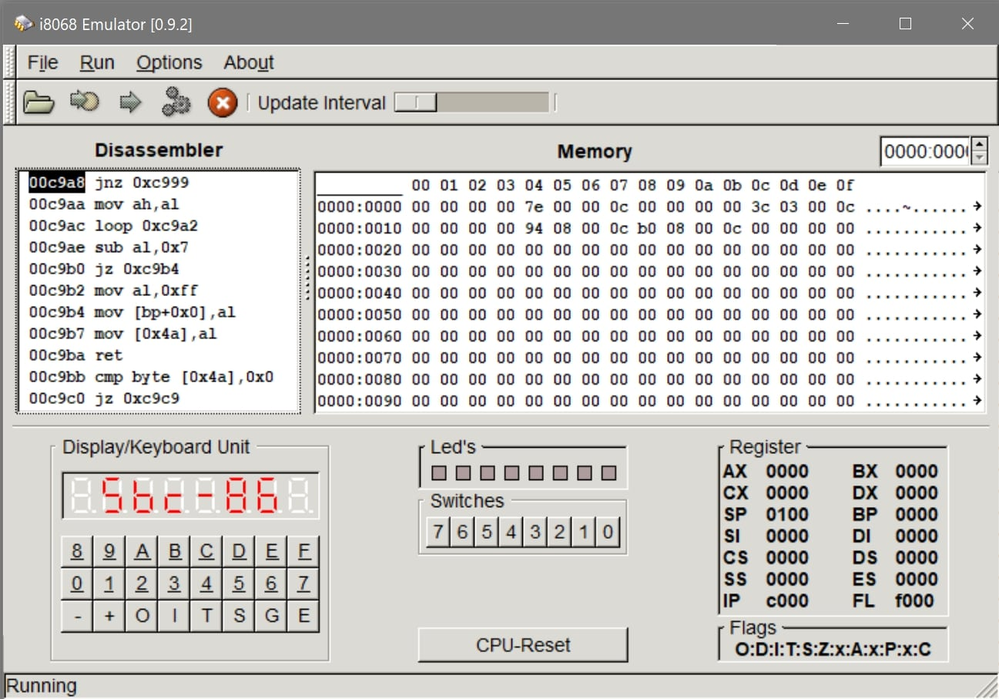

# memstorage-timecounter

Memory evaluation and interruptless timers built by Felix Hildebrandt as final thesis for Assambly Development in 2018.

> **_NOTE:_** The commentary appears in German.

## Picture

## Tools

[i8086 Emulator](http://sourceforge.net/projects/i8086emu/)

A multi-platform i8086 Emulator (SBC-86)
© 2004 Joerg Mueller-Hipper, Robert Dinse,
Fred Brodmueller, Christian Steineck